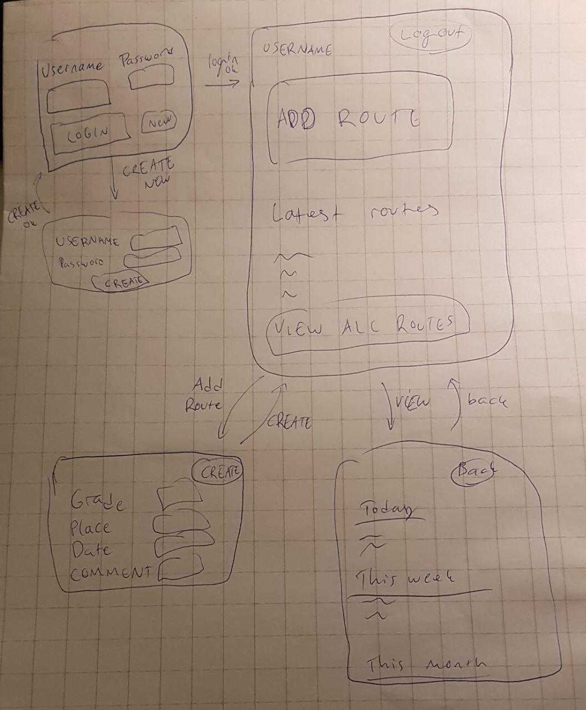

## Vaatimusmäärittely

### Sovelluksen tarkoitus

Sovelluksen on tarkoitus toimia käyttäjän kiipeilypäiväkirjana. Sovellusta voi käyttää useampi käyttäjä, jolloin jokainen näkee henkilökohtaisen kiipeilyhistoriansa.

### Käyttäjät

Aluksi sovelluksella on käyttäjärooleina normaali käyttäjä ja suurempien oikeuksien ylläpitäjäkäyttäjä.

### Käyttöliittymäluonnos

### Perusversion tarjoama toiminnallisuus

**Ennen kirjautumista**

* Käyttäjä voi luoda uuden kirjautumistunnuksen
	* Käyttäjätunnuksen tulee olla uniikki, vähintään kolme kirjainta
	* Käyttäjätunnukselle tulee luoda salasana, joka on vähintään 6 merkkiä pitkä

* Käyttäjä voi kirjautua järjestelmään
	* Kirjautuminen onnistuu antamalla olemassa oleva käyttäjätunnus ja sen salasana
	* Jos käyttäjätunnusta ei ole olemassa tai salasana on väärä, järjestelmä ilmoittaa tästä

**Kirjautumisen jälkeen**

* Käyttäjä voi lisätä uuden kiivetyn reitin
	* Reitin tietoihin annetaan greidi, päivämäärä ja halutessa paikka ja lisäkommentti
	* Uusi reitti lisätään käyttäjän tietokantaan

* Käyttäjä voi tarkastella jo kiivettyjä reittejä kronologisessa järjestyksessä.
	* Reitit ryhmitellään ajallisen etäisyyden mukaan

* Käyttäjä voi kirjautua ulos

### Jatkokehitysideoita

* Reitin poisto muistista
* Kiipeilytilastoja voidaan tarkastella erilaisin ryhmittelyin, esim. greidin, paikan, ajankohdan mukaan
* Reitit pylväskaaviossa greidin mukaan
* Kuvan lisäys uuden reitin lisäämiseen
* Videon lisäys uuden reitin lisäämiseen???
* Käyttäjät voivat ruveta "kavereiksi" ja seurata toistensa edistymistä
* Järjestelmä onnittelee käyttäjää uudesta greidistä
* Tilastoissa eri greidit on merkattu eri värein
